# Agent WebMCP

**Turn a server operations console into a browser-native agent surface.** Agent WebMCP lets humans inspect and control a machine visually while agents discover the same bounded, typed operations directly from the page through WebMCP.

[Devpost project](https://devpost.com/software/agent-webmcp) · [Source](https://github.com/tjXJNOOBIE/agent-webmcp) · [Download source ZIP](https://github.com/tjXJNOOBIE/agent-webmcp/archive/refs/heads/main.zip) · [Download plugin ZIP](dist/agent-webmcp-plugin.zip)

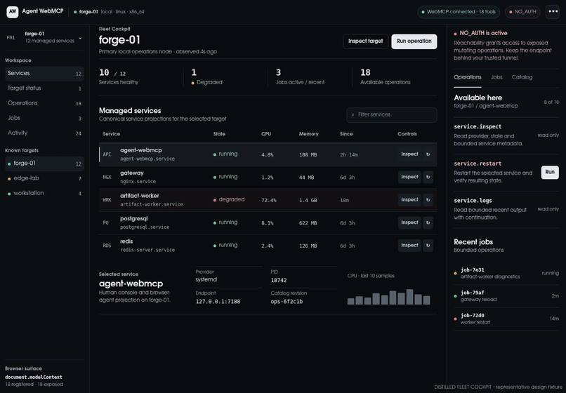

## Why Agent WebMCP

Operations tools were built around a human clicking dashboards, opening terminals, copying logs, and translating what they see into the next command. Agents can reason about that context, but they usually live outside the product and depend on a second automation API that can drift away from the interface people actually use.

Agent WebMCP makes the operations console itself agent-capable.

The browser publishes real application capabilities with `document.modelContext.registerTool(...)`. Those tools are generated from the same canonical Java operation catalog used by the human Fleet Cockpit, HTTP API, CLI, and bounded MCP projection. There is no separate demo-only AI backend to quietly become a second source of truth.

## What it does

Agent WebMCP is a lightweight Java operations runtime and Fleet Cockpit for:

- system health and runtime metrics;
- managed-service discovery, inspection, logs, diagnostics, and lifecycle control;
- runtime agent inventory and monitoring;
- durable service jobs and execution history;
- deterministic scheduled work;
- optional Codex-assisted one-shot jobs when reasoning is actually useful;
- browser-native WebMCP tools projected from the real application operation catalog.

The canonical runtime currently owns **23 operations**, including **9 mutating operations**. The browser-native WebMCP projection exposes **18 tools**. The intentionally narrower remote MCP projection exposes **16 tools**.

## Fleet Cockpit

The Fleet Cockpit is the human side of the same operation model exposed to agents. It keeps service control, operation discovery, activity, jobs, agent monitoring, target selection, and exposure settings visible instead of hiding the product behind a chat wrapper.

<table>
<tr>
<td width="50%"><strong>Operations</strong><br>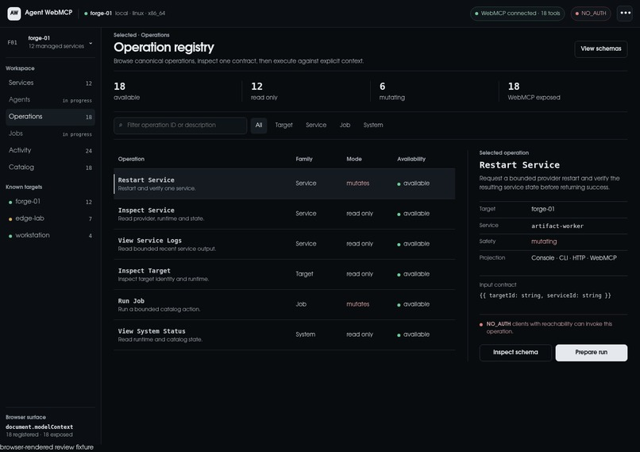</td>
<td width="50%"><strong>Service Control</strong><br>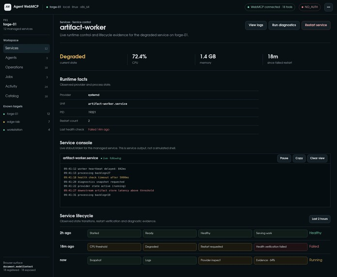</td>
</tr>
<tr>
<td width="50%"><strong>Activity</strong><br>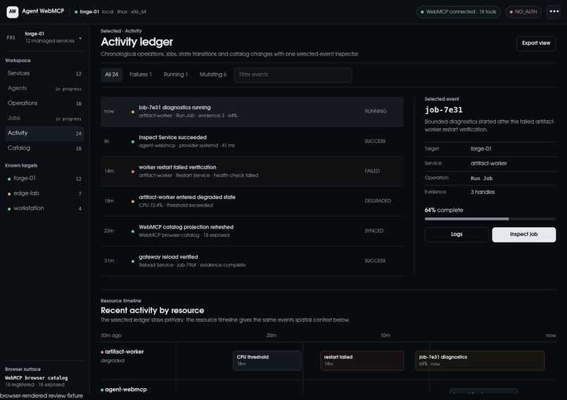</td>
<td width="50%"><strong>Catalog</strong><br>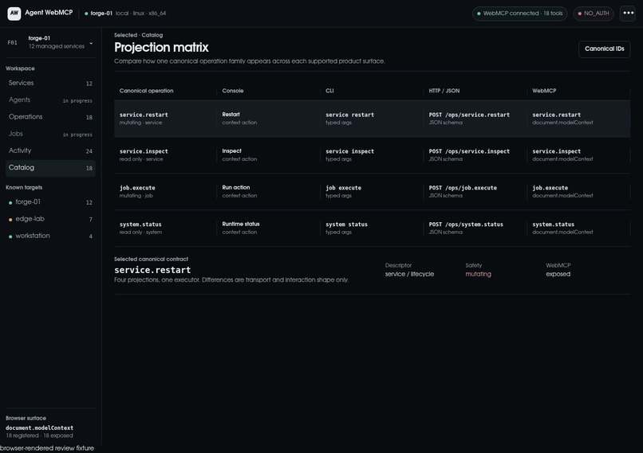</td>
</tr>
<tr>
<td width="50%"><strong>Agents</strong><br>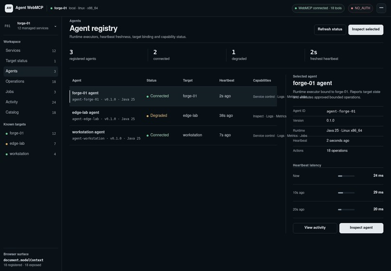</td>
<td width="50%"><strong>Jobs</strong><br>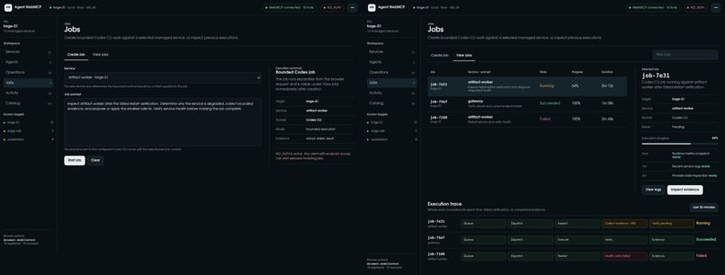</td>
</tr>
<tr>
<td width="50%"><strong>Target Switcher</strong><br>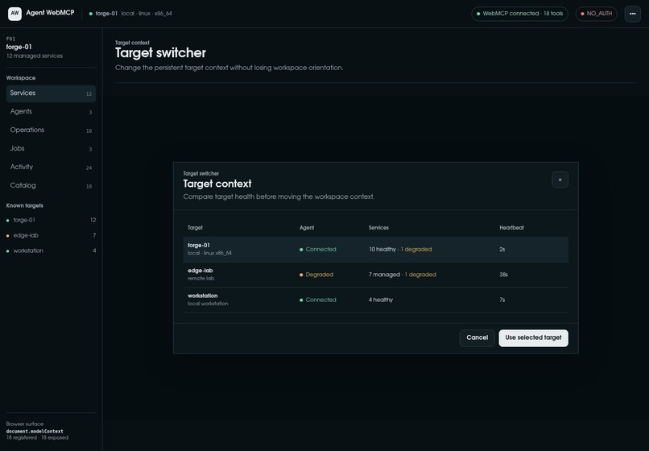</td>
<td width="50%"><strong>Settings</strong><br>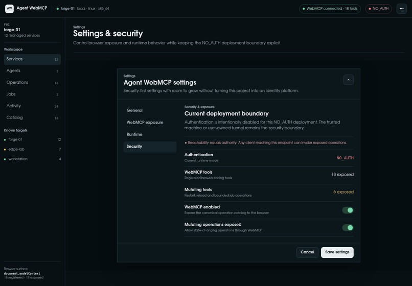</td>
</tr>
</table>

## Browser-native WebMCP

The production page registers operations directly with WebMCP. Each exposed tool receives its operation name, description, generated JSON input schema, access metadata, and an execution callback that forwards into the canonical backend.

That means a service restart means the same thing whether it came from a button, HTTP, CLI, or an agent using WebMCP.

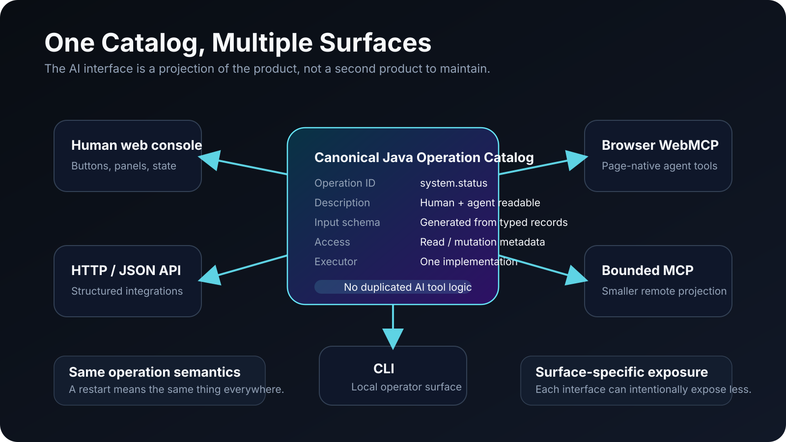

## Bounded by design

Agent WebMCP is operations software, not a prettier remote shell.

- No generic shell tool.
- No arbitrary process execution.
- No unrestricted filesystem mutation.
- Service lifecycle actions operate on managed services.
- Browser and MCP projections are explicit allowlists of canonical operations.
- Jobs are service-bound and durable.
- Provider state remains the authority for real machine state.
- `NO_AUTH` is intended for a trusted local/private boundary, not casual public exposure.

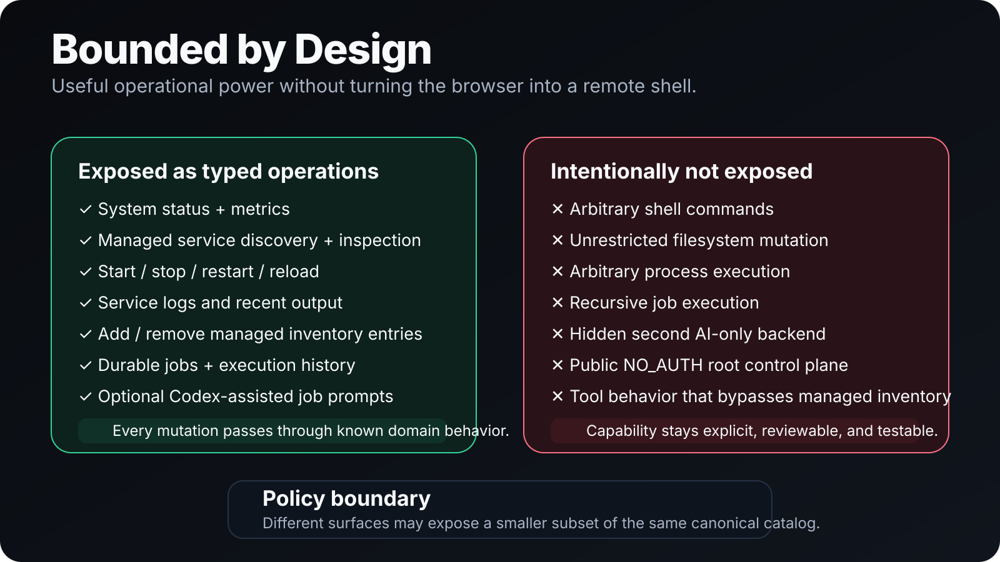

## Install

### Requirements

- Linux
- Java 25+
- Git
- `curl`
- network access for the Gradle source-dependency build

### Install Agent WebMCP

```bash
git clone https://github.com/tjXJNOOBIE/agent-webmcp.git
cd agent-webmcp
./scripts/install.sh
./scripts/verify-install.sh
```

The default install runs as a systemd **user** service and binds locally on `127.0.0.1:7188`.

Useful checks:

```bash
systemctl --user status agent-webmcp.service
curl -fsS http://127.0.0.1:7188/health
```

For a portable install without systemd:

```bash
./scripts/install.sh --no-service
```

For full system-service authority on a dedicated operations machine:

```bash
bash ./scripts/gradle installDist
sudo ./scripts/install.sh --dist "$PWD/build/install/agent-webmcp" --system-service
```

## Install the plugin

The repository is a ChatGPT/Codex-compatible plugin marketplace. The plugin is intentionally usable as a skills-only package and does not require a second execution backend.

### Codex CLI

```bash
./scripts/install-plugin.sh
```

Equivalent commands:

```bash
codex plugin marketplace add "$PWD" --json
codex plugin add agent-webmcp@agent-webmcp --json
codex plugin list --json
```

### ChatGPT workspace marketplace

From **Workspace settings → Plugins → Add → Import marketplace**:

- **Source:** `https://github.com/tjXJNOOBIE/agent-webmcp`
- **Path:** leave empty
- **Branch:** `main`

Then set the Agent WebMCP plugin installation policy to **Available** or **Installed** for the roles that should use it.

Workspace import and plugin availability depend on the ChatGPT workspace, role, and plan controls exposed to your account.

## Download

- **Full project:** [main.zip](https://github.com/tjXJNOOBIE/agent-webmcp/archive/refs/heads/main.zip)
- **Plugin-only package:** [dist/agent-webmcp-plugin.zip](dist/agent-webmcp-plugin.zip)

The plugin package contains the marketplace manifest plus the Agent WebMCP plugin directory, so it can be extracted and used as a standalone local marketplace checkout.

## Deploy or update another machine

Once the repository is cloned on a machine, the repeatable deployment entry point is:

```bash
./scripts/deploy-main.sh
```

It requires a clean Git worktree, fast-forwards to `origin/main`, runs the repository quality preflight, builds the distribution, installs it through the existing installer, and verifies the local runtime. The script is intentionally suitable for either a human operator or another agent session.

Installer arguments can be forwarded after `--`, for example:

```bash
./scripts/deploy-main.sh -- --no-service
./scripts/deploy-main.sh -- --system-service
```

Use `--no-update` when validating the current checkout without switching to `main`.

## Architecture

The JDK `HttpServer` is only the transport edge. The typed Java operation catalog is canonical, and the UI, HTTP/JSON, CLI, WebMCP, and MCP surfaces adapt that same behavior instead of duplicating it.

Tavall DI owns first-party runtime composition. Tavall Registry owns the typed operation catalog. Tavall Concurrency owns shared asynchronous execution. Tavall Logging owns runtime logging.

The local application endpoints are:

- `GET /health`
- `GET /api/v1/operations`
- `POST /api/v1/operations/{operationId}`
- `POST /mcp`
- `/` and `/assets/...` for the Fleet Cockpit and browser-native WebMCP surface

## Validate the release

```bash
bash scripts/quality-preflight.sh --manifest
bash scripts/verify-codex-plugin.sh
bash scripts/verify-webmcp-challenge.sh
bash scripts/gradle test
```

Browser E2E coverage is available through the repository's Gradle `e2e` task when the Playwright runtime is installed.

## Hackathon evidence

Implementation evidence and judge verification are documented in [`docs/hackathon/WEBMCP_CHALLENGE.md`](docs/hackathon/WEBMCP_CHALLENGE.md).

The project is released under the [MIT License](LICENSE).
