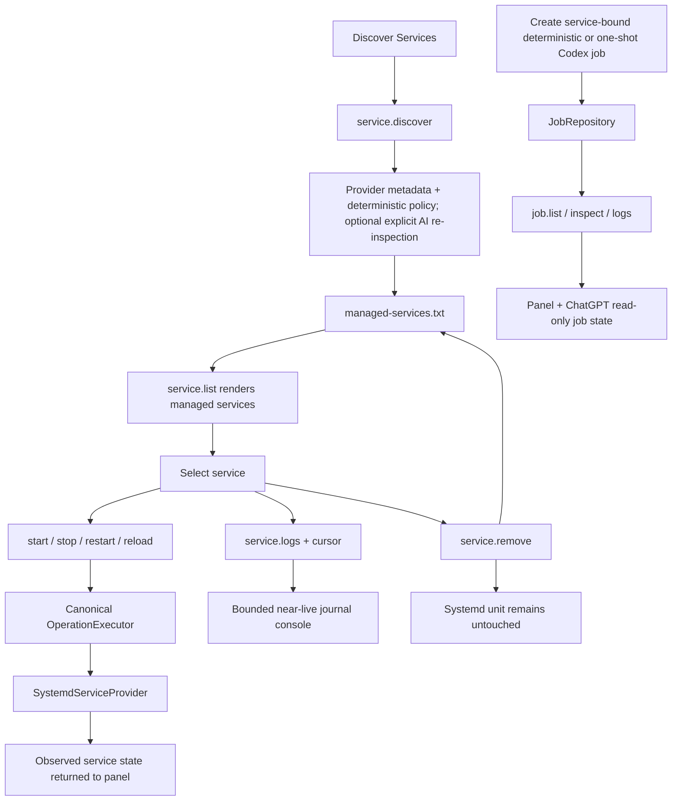
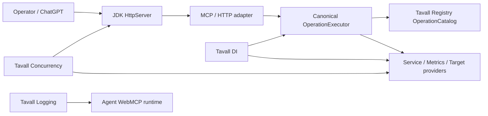
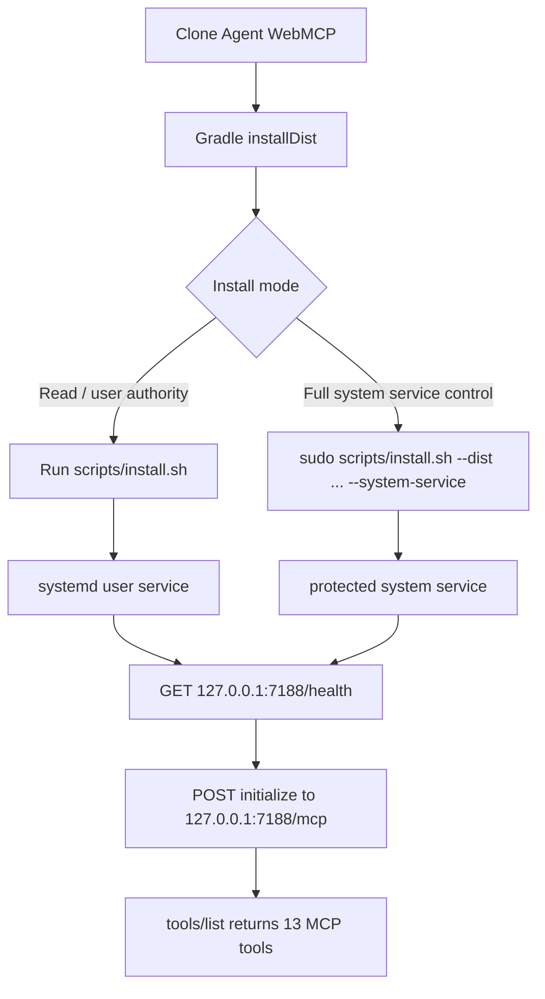
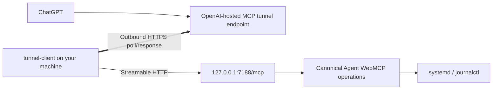
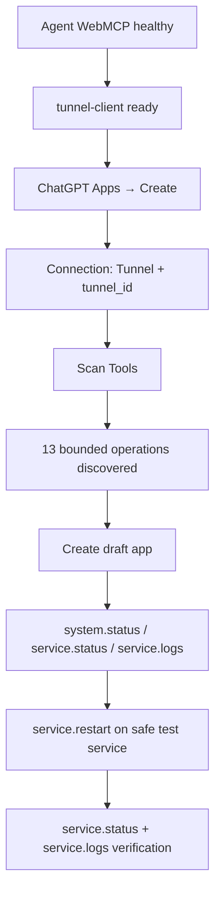
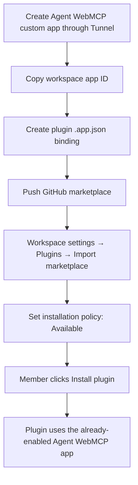
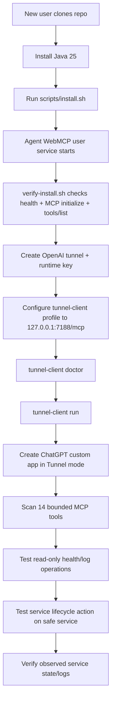

# Agent WebMCP

Agent WebMCP is a lightweight Java operations server that exposes one canonical Tavall-owned operation runtime through CLI, HTTP/JSON, WebMCP, and a bounded Model Context Protocol (MCP) app surface.

The application deliberately stops short of becoming a remote shell. The app-facing MCP surface is for **managed service control, bounded near-live service logs, general system/service health, and read-only machine-agent job state**.

## WebMCP Challenge build

This repository contains a browser-native WebMCP implementation for the OpenAI WebMCP Challenge. The production page registers the canonical operation catalog with `document.modelContext.registerTool(...)`; it does **not** treat the separate `/mcp` endpoint as a substitute for WebMCP. The browser tools reuse the same JSON Schemas, access metadata, validation, and Java operation executor as the human Fleet Cockpit.

Submission/implementation evidence, dated commit provenance, and judge verification steps are documented in [`docs/hackathon/WEBMCP_CHALLENGE.md`](docs/hackathon/WEBMCP_CHALLENGE.md). The repository is released under the root [`LICENSE`](LICENSE).

## Current capabilities

The canonical runtime owns **21 operations / 9 mutating**. WebMCP exposes an explicit **16-tool** browser projection, while the narrower ChatGPT/MCP app exposes **14 tools** for health/metrics, managed-service observability/lifecycle, diagnostics, and read-only job state.

| MCP tool | Purpose | Access |
| --- | --- | --- |
| `system.status` | Runtime/provider/auth health summary | Read |
| `metrics.snapshot` | JVM/OS metrics snapshot | Read |
| `service.list` | List services enrolled in Agent WebMCP | Read |
| `service.inspect` | Inspect one service in detail | Read |
| `service.status` | Read current service state | Read |
| `service.logs` | Read bounded cursor-based journal output | Read |
| `service.diagnostics` | Run bounded provider-backed service diagnostics | Read |
| `service.start` | Start a service | Write |
| `service.stop` | Stop a service | Write |
| `service.restart` | Restart a service | Write |
| `service.reload` | Reload a service | Write |
| `job.list` | List recent durable machine-agent jobs | Read |
| `job.inspect` | Inspect one job and its linked agent/result | Read |
| `job.logs` | Read bounded job lifecycle logs | Read |

The canonical catalog is intentionally larger than either machine-facing projection. WebMCP exposes 16 explicitly allowed operations. MCP is narrower at 14 tools: it includes `service.diagnostics`, service lifecycle/observability, system metrics/status, and read-only durable job state, while keeping discovery, job execution/cancellation, target workflows, and managed-inventory mutation outside the remote app surface.

Managed-service enrollment remains the lifecycle authority boundary. `service.inspect`, `service.status`, `service.logs`, `service.diagnostics`, `service.start`, `service.stop`, `service.restart`, and `service.reload` reject unenrolled IDs with `SERVICE_NOT_MANAGED` before provider access. `service.discover` can register deterministic custom/operator candidates; optional Codex-assisted discovery is explicit, read-only, accepts only service IDs, and re-inspects every returned ID through the real provider.

Jobs are service-bound. Deterministic jobs can run only `service.start`, `service.stop`, `service.restart`, or `service.reload`; one-shot AI jobs use the user's existing Codex CLI with a provider-owned service working directory. Recurring AI jobs are rejected. There is no generic shell tool, arbitrary browser-supplied working directory, or MCP filesystem/process escape hatch.

`service.logs` is near-live through bounded repeated reads and cursors. It is not an unbounded interactive terminal stream.

### Fleet Cockpit interaction flow



## Architecture

The JDK server is intentionally only a transport edge. Tavall Java tools own application concerns.



The local HTTP endpoints are:

- `GET /health`
- `GET /api/v1/operations`
- `POST /api/v1/operations/{operationId}`
- `POST /mcp` for Streamable HTTP MCP JSON-RPC
- `GET /mcp` returns `405` because this server does not need a standalone server-to-client SSE listener
- `/` and `/assets/...` for the browser/WebMCP surface

The MCP adapter supports the deployed session-oriented MCP versions used by current tunnel clients and accepts the newer stateless protocol version header. It validates browser `Origin` when present and defaults to loopback binding.

## Install the application

### Requirements

- Linux with systemd for the default service-provider path
- Java 25 or newer
- Git
- Network access during the Gradle source-dependency build
- `curl` for the verification helper

Clone and install:

```bash
git clone https://github.com/tjXJNOOBIE/agent-webmcp.git
cd agent-webmcp
./scripts/install.sh
```

The default install writes:

```text
~/.local/share/agent-webmcp/             application distribution
~/.config/agent-webmcp/agent-webmcp.env configuration
~/.local/state/agent-webmcp/             durable state
~/.config/systemd/user/agent-webmcp.service
```

Default configuration:

```text
AGENT_WEBMCP_HOST=127.0.0.1
AGENT_WEBMCP_PORT=7188
AGENT_WEBMCP_DATA_DIR=$HOME/.local/state/agent-webmcp
```

The installer enables and starts the systemd **user** service. Verify it with:

```bash
systemctl --user status agent-webmcp.service
curl -fsS http://127.0.0.1:7188/health
./scripts/verify-install.sh
```

The user-service mode is suitable for health, metrics, catalog, jobs, and whatever systemd reads the account is allowed to perform. On a normal Linux host, system-level `start`/`stop`/`restart`/`reload` is usually denied by PolicyKit. For the **full system-service control path** on a dedicated operations machine, build as your normal user and then install the already-built distribution as a protected root system service:

```bash
./gradlew --no-daemon installDist
sudo ./scripts/install.sh \
  --dist "$PWD/build/install/agent-webmcp" \
  --system-service
sudo systemctl status agent-webmcp.service
curl -fsS http://127.0.0.1:7188/health
```

System mode defaults to `/opt/agent-webmcp`, `/etc/agent-webmcp`, and `/var/lib/agent-webmcp`, and installs `/etc/systemd/system/agent-webmcp.service`. The unit keeps `NoNewPrivileges`, `PrivateTmp`, `ProtectHome`, and `ProtectSystem=strict`, with only the Agent WebMCP state directory writable. It nevertheless has root service-control authority, so keep the HTTP/MCP bind on loopback and use the private tunnel boundary. **Do not expose a `NO_AUTH` root control plane directly to the network.**

For a portable/test install without systemd:

```bash
./scripts/install.sh --no-service
set -a
. ~/.config/agent-webmcp/agent-webmcp.env
set +a
~/.local/share/agent-webmcp/bin/agent-webmcp serve
```

You can override the install paths and bind address with `--prefix`, `--config-dir`, `--state-dir`, `--host`, and `--port`. Keep `127.0.0.1` unless you have an explicit private-network design. The intended ChatGPT path uses Secure MCP Tunnel instead of a public bind.

### Application setup flow



## Connect through OpenAI Secure MCP Tunnel

Do **not** expose port `7188` to the public internet for the normal ChatGPT setup. OpenAI Secure MCP Tunnel keeps Agent WebMCP private and has the customer-side `tunnel-client` initiate outbound HTTPS to OpenAI.

### 1. Create the OpenAI tunnel

Open:

- Tunnels: `https://platform.openai.com/settings/organization/tunnels`
- Runtime API keys: `https://platform.openai.com/settings/organization/api-keys`

Create a tunnel and copy its `tunnel_...` ID. Create a **runtime** API key whose principal has **Tunnels Read + Use** for that tunnel. Do not use a long-lived admin key for the tunnel daemon.

Download the supported `tunnel-client` from the Tunnels page or the official release page:

`https://github.com/openai/tunnel-client/releases/latest`

Start with:

```bash
tunnel-client help quickstart
tunnel-client help samples
```

### 2. Configure the tunnel for Agent WebMCP

The private MCP target is:

```text
http://127.0.0.1:7188/mcp
```

A named profile is convenient:

```bash
export CONTROL_PLANE_API_KEY='sk-...'

tunnel-client init \
  --sample sample_mcp_remote_no_auth \
  --profile agent-webmcp \
  --tunnel-id tunnel_0123456789abcdef0123456789abcdef \
  --mcp-server-url http://127.0.0.1:7188/mcp

tunnel-client doctor --profile agent-webmcp --explain
tunnel-client run --profile agent-webmcp
```

Keep `tunnel-client run` alive while ChatGPT is scanning or using the app. For a separately supervised long-lived tunnel, use the lifecycle facilities provided by `tunnel-client` rather than improvising `nohup`.

### Tunnel flow



No inbound public firewall rule is required for Agent WebMCP in this design.

## Create the ChatGPT app and test the connection

Current ChatGPT custom-app setup scans the MCP server tools and creates a draft app. With Secure MCP Tunnel, choose the **Tunnel** connection mode and select/paste your `tunnel_id`; do not paste the private `127.0.0.1` URL into ChatGPT.

1. Make sure Agent WebMCP is healthy.
2. Make sure `tunnel-client doctor --profile agent-webmcp --explain` succeeds.
3. Keep `tunnel-client run --profile agent-webmcp` running.
4. In ChatGPT, enable Developer Mode where your plan/workspace supports it.
5. Open **Settings / Workspace settings → Apps → Create**.
6. Name the app **Agent WebMCP**.
7. Choose **Tunnel** and select or paste the created `tunnel_...` ID.
8. Use **No Auth** for the MCP target. The tunnel runtime key belongs to `tunnel-client`, not to ChatGPT app fields.
9. Click **Scan Tools**. The scan should discover exactly the 13 app-facing tools listed above.
10. Click **Create**. The app should appear as a draft/development app.
11. Start a new chat with Agent WebMCP selected and test a read-only call first, for example: `Show the current Agent WebMCP system status.`
12. Then test logs: `Show the latest logs for demo.service.`
13. Only after read paths work, test a write action such as restart against a disposable/non-production service.



### Plan/workspace note

OpenAI currently documents full custom MCP write/modify actions for Business and Enterprise/Edu workspaces. Pro can connect custom MCP with read/fetch permissions in developer mode. **Plus is not currently listed as supporting custom MCP developer-mode apps**, so this Plus account may not expose the Create/Developer Mode flow even though the local server and tunnel protocol are valid. A Business/Enterprise/Edu workspace is the supported path for testing `service.start/stop/restart/reload` from ChatGPT today.

## Plugin package

This repository includes an installable plugin package at:

```text
plugins/agent-webmcp/
.agents/plugins/marketplace.json
```

The package follows the current OpenAI plugin repository shape with `.codex-plugin/plugin.json`, marketplace metadata, and a focused Agent WebMCP skill. It intentionally does **not** declare `.mcp.json`: current OpenAI behavior can mark imported plugins that declare MCP servers as Desktop only, which prevents the ChatGPT-web experience we want.

A ChatGPT plugin that wraps the **workspace custom app** needs the app ID assigned by ChatGPT after the draft app is created. That ID cannot be truthfully pre-generated in this repository. `plugins/agent-webmcp/app-binding.example.json` contains the exact binding shape. Once the app exists, copy it to `.app.json`, replace the placeholder with the real workspace app ID, and add `"apps": "./.app.json"` to the plugin manifest.

### Make the plugin clickable in a workspace

After this repository branch is pushed to GitHub, a workspace admin can import the marketplace from **Workspace settings → Plugins → Add → Import marketplace**. Use `https://github.com/tjXJNOOBIE/agent-webmcp` as Source, leave Path empty because `.agents/plugins/marketplace.json` is at the repository root, and select the branch containing the plugin until it lands on `main`. After import, set the plugin installation policy to **Available** so eligible members see **Install plugin**. GitHub marketplace import is a workspace-admin feature and does not create or authorize the underlying custom app.



## New-user interaction flow

This is the complete intended first-run path:



## Development and validation

Run the required quality preflight first:

```bash
bash scripts/quality-preflight.sh --print
```

Canonical Gradle validation is:

```bash
./gradlew test
./gradlew e2e
./gradlew check
```

The Tavall host-local validation sandbox currently has a known Gradle daemon loopback/IPC limitation, so repository work may also record direct Java 25 compilation against the real Tavall source dependencies plus JUnit/Playwright evidence when Gradle cannot reach its own single-use daemon. That infrastructure limitation must not be reported as a passing Gradle build.

See `docs/architecture/OPERATION_SURFACE.md`, `docs/architecture/HTTP_TRANSPORT.md`, and `docs/backend/PORT_AND_E2E.md` for the owning runtime contracts.
